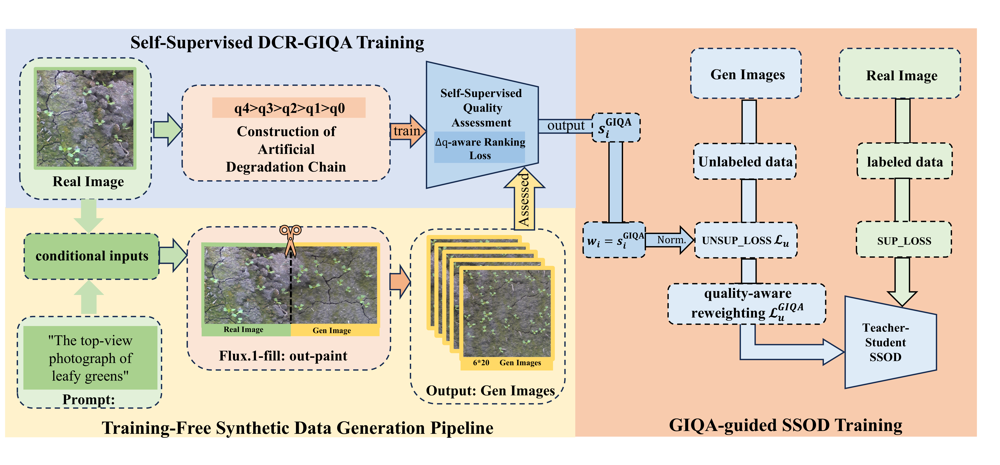
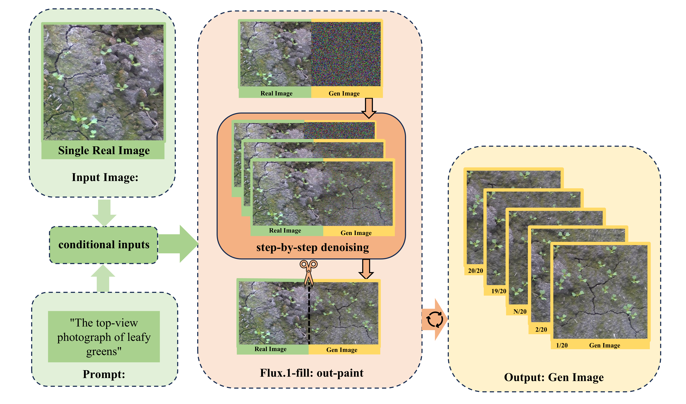
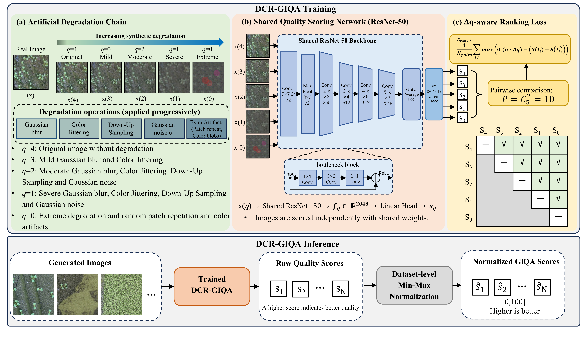
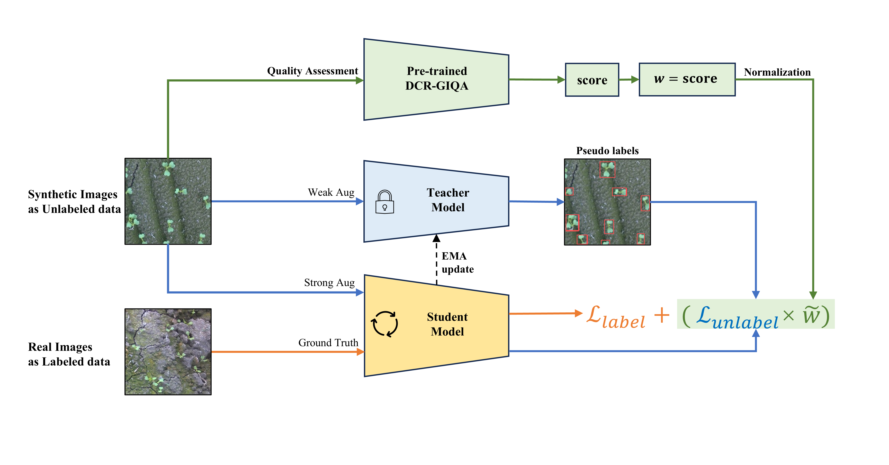

# ReSynDet

ReSynDet is a quality-aware semi-supervised object detection framework for
learning from a small set of labeled real images and additional synthetic
unlabeled images. It combines training-free image generation, generated-image
quality assessment, and quality-guided detector training.

<p align="center">
  
</p>

## Components

### 1. Training-free synthetic data generation

Real images are outpainted with a FLUX.1 Fill workflow to produce diverse
synthetic images without training an additional generation model.

<p align="center">
  
</p>

[Code and usage instructions](Training-free-synthetic-data-generation/)

### 2. DCR-GIQA

DCR-GIQA learns to assess generated-image quality from degradation-chain
ranking supervision and assigns a quality score to each synthetic image.

<p align="center">
  
</p>

[Code and usage instructions](DCR-GIQA/)

### 3. GIQA-Guided SSOD

GIQA scores are linearly mapped and normalized into per-image weights. These
weights scale the unlabeled RPN and ROI losses during teacher-student detector
training, reducing the influence of low-quality synthetic images.

<p align="center">
  
</p>

[Code and usage instructions](GIQA-Guided-SSOD/)

## Repository structure

```text
.
|-- Training-free-synthetic-data-generation/
|-- DCR-GIQA/
|-- GIQA-Guided-SSOD/
|-- assets/
|-- LICENSE
`-- THIRD_PARTY_NOTICES.md
```

Each component directory contains its own setup and usage instructions. Model
weights and datasets are not included and must be prepared separately.

## License and attribution

Original ReSynDet code is released under the [MIT License](LICENSE).
Third-party dependencies, licenses, and derivative-code attribution are
documented in [THIRD_PARTY_NOTICES.md](THIRD_PARTY_NOTICES.md) and in the
notices distributed with the corresponding components.
